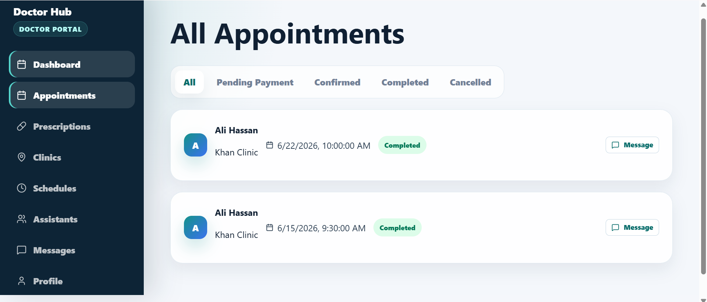

# Doctor Hub

Doctor Hub is a full-stack healthcare appointment platform for **patients, doctors, assistants, admins, and super admins**. It helps patients discover doctors, book appointments, upload payment proofs, view medical history, manage prescriptions, and exchange messages. Doctors can manage clinics, schedules, appointments, prescriptions, assistants, messages, and their public profile. Admin and super admin users can manage platform users, doctors, reports, and platform operations.

## Live Site

🔗 **Site URL:** https://doctor-hub-beta.vercel.app/

## Demo Login

Seeded demo users are created by running `npm run seed` inside the `backend` folder.

| Role | Email | Password |
| --- | --- | --- |
| Super Admin | `superadmin@doctorhub.com` | `SuperAdmin@123` |
| Admin | `admin@doctorhub.com` | `Admin@12345` |
| Doctor | `doctor@doctorhub.com` | `Doctor@123` |
| Patient | `patient@doctorhub.com` | `Patient@123` |

> Assistant accounts are not seeded by default. Log in as the demo doctor and create an assistant from the doctor assistant management area.

## Tech Stack

- **Frontend:** React, Vite, React Router, Axios, Lucide React
- **Backend:** Node.js, Express.js, JWT Authentication
- **Database:** Supabase
- **Storage:** Supabase Storage
- **Uploads:** Multer memory uploads stored in Supabase Storage

## Main Features

- Public doctor search and doctor profile pages
- Patient registration and login
- Role-based dashboards for Patient, Doctor, Assistant, Admin, and Super Admin
- Appointment booking, cancellation, completion, and auto-expiry cleanup
- Doctor clinic and schedule management
- Prescription and medical history management
- Patient payment upload and doctor/assistant payment verification
- In-app messages and notifications
- Admin user, doctor, and report management
- Doctor assistant management with a limit of 3 assistants per doctor

## Project Structure

```text
doctor-hub/
  src/                 Frontend React app
  public/              Static frontend assets
  backend/
    src/               Express API source
    uploads/           Local upload folder for development only
    data/              Backend data folder
```

## Screenshots

### Site Screenshots

<table>
  <tr>
    <td></td>
    <td></td>
  </tr>
  <tr>
    <td></td>
    <td></td>
  </tr>
  <tr>
    <td></td>
    <td></td>
  </tr>
</table>

### Patient Portal

<table>
  <tr>
    <td></td>
    <td></td>
  </tr>
  <tr>
    <td></td>
    <td></td>
  </tr>
  <tr>
    <td></td>
    <td></td>
  </tr>
  <tr>
    <td></td>
    <td></td>
  </tr>
</table>

### Doctor Portal

<table>
  <tr>
    <td></td>
    <td></td>
  </tr>
  <tr>
    <td></td>
    <td></td>
  </tr>
  <tr>
    <td></td>
    <td></td>
  </tr>
  <tr>
    <td></td>
    <td></td>
  </tr>
  <tr>
    <td></td>
    <td></td>
  </tr>
</table>

### Assistant Portal

<table>
  <tr>
    <td></td>
    <td></td>
  </tr>
  <tr>
    <td></td>
    <td></td>
  </tr>
</table>

### Admin Portal

<table>
  <tr>
    <td></td>
    <td></td>
  </tr>
  <tr>
    <td></td>
    <td></td>
  </tr>
  <tr>
    <td></td>
    <td></td>
  </tr>
</table>

### Super Admin Portal

<table>
  <tr>
    <td></td>
    <td></td>
  </tr>
  <tr>
    <td></td>
    <td></td>
  </tr>
  <tr>
    <td></td>
    <td></td>
  </tr>
  <tr>
    <td></td>
    <td></td>
  </tr>
</table>

## Prerequisites

- Node.js
- npm
- Supabase project credentials

## Environment Variables

Create or update `backend/.env`:

```env
PORT=5000
JWT_SECRET=your_jwt_secret
SUPABASE_URL=your_supabase_url
SUPABASE_SERVICE_ROLE_KEY=your_supabase_service_role_key
SUPABASE_ANON_KEY=your_supabase_anon_key
SUPABASE_STORAGE_BUCKET=doctor-hub-uploads
```

The frontend uses this optional variable:

```env
VITE_API_URL=http://localhost:5000/api
```

If `VITE_API_URL` is not set, the frontend defaults to:

```text
http://localhost:5000/api
```

## Installation

Install frontend dependencies from the project root:

```bash
npm install
```

Install backend dependencies:

```bash
cd backend
npm install
```

## Database Setup

Run the SQL schema in Supabase from:

```text
backend/src/config/schema.sql
```

Then seed demo users:

```bash
cd backend
npm run seed
```

## Supabase Storage Setup

Vercel Serverless Functions cannot persist files inside `backend/uploads`. Payment screenshots and medical reports are uploaded to Supabase Storage instead.

Create a public Supabase Storage bucket:

```sql
insert into storage.buckets (id, name, public)
values ('doctor-hub-uploads', 'doctor-hub-uploads', true)
on conflict (id) do update set public = true;
```

If you use a different bucket name, set `SUPABASE_STORAGE_BUCKET` in the backend environment variables.

## Run the App

Start the backend API:

```bash
cd backend
npm run dev
```

Backend URL:

```text
http://localhost:5000
```

Health check:

```text
http://localhost:5000/api/health
```

Start the frontend from the project root:

```bash
npm run dev
```

Frontend URL:

```text
http://localhost:5173
```

## Useful Scripts

Frontend scripts:

```bash
npm run dev
npm run build
npm run preview
npm run lint
```

Backend scripts:

```bash
npm run dev
npm start
npm run seed
```

## Port Notes

If `npm run dev` in the `backend` folder fails with this error:

```text
EADDRINUSE: address already in use :::5000
```

It means another backend process is already running on port `5000`. Stop that process or use the already-running API at:

```text
http://localhost:5000
```

## License

This project is created for learning, academic, and demonstration purposes.
